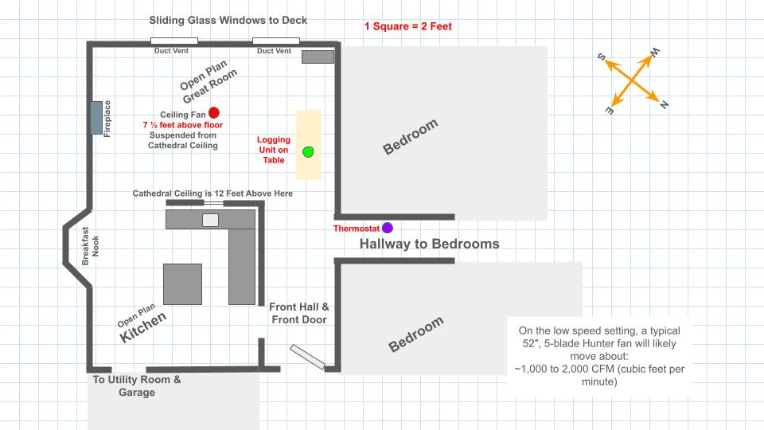

# Documentation

This folder contains diagrams, photos, and supporting material for the
Ceiling Fan / Furnace Study.

## Fritzing
Wiring diagrams for the furnace data logger and remote listener nodes.

## Photos
Physical layout and installation reference images.

## Room Layouts

### Main Floor Layout

This diagram shows the main floor layout, including the ceiling fan,
thermostat location, and base unit placement used in the study.

